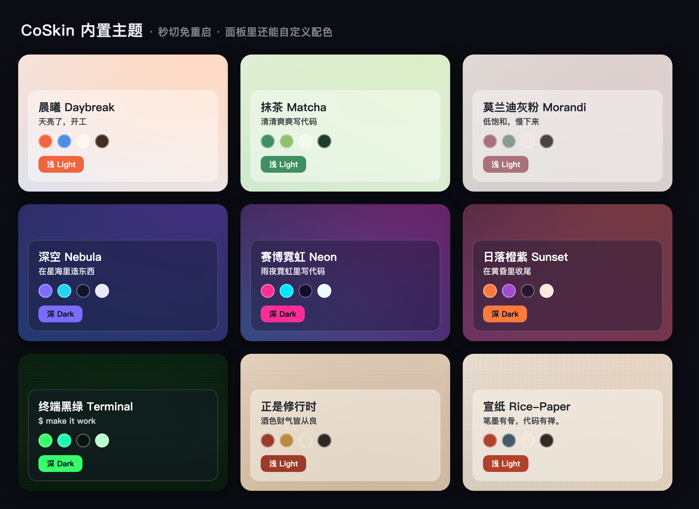
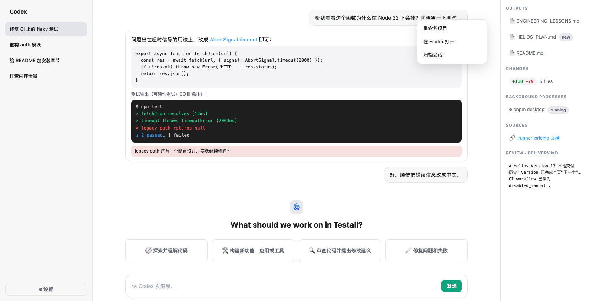
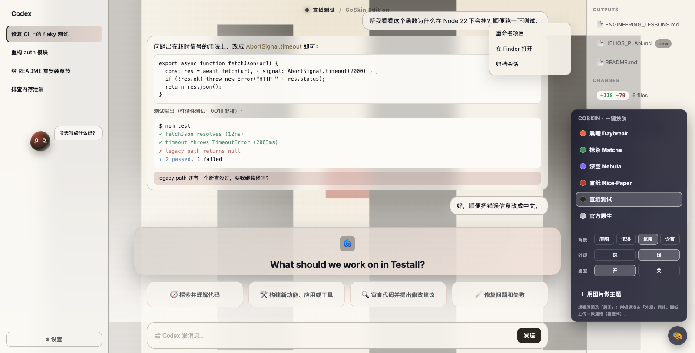
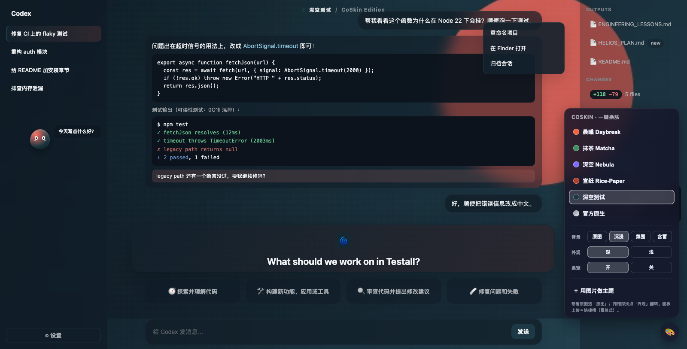

# CoSkin — 给 Codex Desktop 一键换肤（token 编译器）

写代码的地方，也该顺眼。CoSkin 通过**本机回环 CDP 注入**给 Codex Desktop（macOS 上就是
`/Applications/ChatGPT.app`，bundle id `com.openai.codex`）换肤：不改 `app.asar`、不动签名、
不装常驻进程，正常重启一次 Codex 就完全回到官方原样。

**v0.3 起不是「换壁纸」而是「接管调色板」**：一张图片或一句话被编译成对 Codex 官方设计
令牌（`--color-token-*` / `--color-*` / `--vscode-*`，约 110 个变量）的整套覆写——侧栏、
菜单、按钮、滚动条、diff 红绿、内嵌终端的 ANSI 16 色、深浅外观类，**每个控件**都跟随主题，
且自动做对比度兜底。官方 token 清单为真机实测（[docs/codex-token-inventory.json](docs/codex-token-inventory.json)）。

**9 款内置主题全部是纯 CSS 渐变**（零素材、零版权风险），开箱即用。

> 状态：机制与控件级接管已在隔离环境验证（60+ 项断言，见 `docs/verify/`），代码零依赖。
> **全新电脑只要装了 Codex 就能双击直接跑** —— 没有 Node 会自动免密装绿色版到用户目录。
> **macOS**：完整支持、日期化真机验证，含可钉 Dock 的 `CoSkin.app` 清爽启动器。
> **Windows**：独立安装版已实现（`双击换肤(无窗口).vbs` / `双击换肤.bat`），但尚未真机验证；
> Microsoft Store/MSIX 版暂不支持（无法可靠带调试参数启动）。
> 需要已装好的 Codex Desktop。

## 内置皮肤（9 款，纯渐变开箱即用）



> 面板里内置主题**免重启秒切**；不够就点「🎨 自定义配色」实时调一套自己的（色轮 / hex / 🎲 随机），
> 「＋ 存为我的主题」永久留在列表、还能导出成 `.coskin` 发给朋友。

| id | 名称 | 外观 | 气质 |
| --- | --- | --- | --- |
| `nebula` | 深空 Nebula | 深 | 紫青星云 |
| `neon` | 赛博霓虹 Neon | 深 | 霓虹雨夜 |
| `terminal` | 终端黑绿 Terminal | 深 | 磷光绿老派终端 |
| `sunset` | 日落橙紫 Sunset | 深 | 橙紫黄昏 |
| `daybreak` | 晨曦 Daybreak | 浅 | 暖橙晨光 |
| `matcha` | 抹茶 Matcha | 浅 | 清爽绿意 |
| `morandi` | 莫兰迪灰粉 Morandi | 浅 | 低饱和灰粉 |
| `xuanzhi` | 宣纸 Rice-Paper | 浅 | 水墨朱砂（「一句话→主题」示例，带笔墨纸砚卡片字）|
| `xiuxing` | 正是修行时 | 浅 | 朱砂金墨 · 酒色财气全套 decor（横幅/卡片字/戒条/桌宠台词的满配示范）|

每款都带主题化的横幅文案与桌宠台词；`xiuxing` 演示了 `cards`/`subCards` 把首页四张
建议卡改成「酒色财气」并配双行戒条——想仿制照它的 [themes/xiuxing.json](themes/xiuxing.json) 抄字段即可。

## 安装（第一次用）

**唯一前置：装好 Codex Desktop。就这一个。**
**没有 Node 也没关系** —— 首次运行时 CoSkin 会自动把官方绿色版 Node 装进你的用户目录
（macOS `~/.coskin/node`、Windows `%LOCALAPPDATA%\CoSkin\node`），约 50MB、只此一次、
**全程不需要密码 / 不需要管理员**（不碰任何系统目录，卸载就是删掉那个文件夹）。
下载包会用 nodejs.org 官方 SHA-256 校验，不匹配直接丢弃。当然，系统里已经有 Node 22+ 就直接用它。

**拿到代码：两种都行**

```bash
# ① git clone（推荐：以后能一键自动更新）
git clone https://github.com/YzYhhhstudy/codex-coskin.git
```

② 或者在 GitHub 页面点 **Code → Download ZIP**，**用访达（Finder）双击解压**。
> ⚠️ 别用命令行 `unzip` 解压：老版 Info-ZIP 会把中文文件名弄成乱码。访达/资源管理器解压没问题
> （实测中文名和可执行权限都完好）。ZIP 装的没有 `.git`，自动更新会跳过并提示你重新下载新 ZIP。

### macOS

进 `codex-coskin` 文件夹，**双击 `CoSkin.app`**（推荐，无终端窗口、可钉 Dock）
或 `双击换肤.command`（会显示进度，方便排错）。

> 首次打开被 Gatekeeper 拦下（未签名 App）：**右键 →「打开」**放行一次即可，不需要开终端。
> 如果你偏好命令行一次性解除：`xattr -dr com.apple.quarantine .`

### Windows

进入 `codex-coskin` 文件夹，**双击 `双击换肤(无窗口).vbs`**（无黑窗口、可固定到任务栏，推荐）；
想看进度 / 排错就双击 `双击换肤.bat`（会显示控制台）。两者做的事一样。
（目前支持 ChatGPT 独立安装版；Microsoft Store 版暂不支持。Windows 端为社区代码、
尚未在真机充分验证，遇到问题欢迎提 issue。）

> 不想双击、想用命令行：`node src/coskin.mjs menu`（Windows：`node src\coskin.mjs menu`）。

## 傻瓜式上手（3 步）

1. **双击** `双击换肤.command`（macOS）/ `双击换肤.bat`（Windows）——它会启动 Codex（带皮肤）、
   顺手拉最新代码、贴上你上次用过的主题（第一次没有记录就用默认主题）。
2. 如果 Codex 正在运行，工具会先问你「现在重启它吗？」——**输 `y` 回车**即可
   （对话记录会保留，Codex 自动恢复；不同意就什么都不会动）。
3. Codex 里点**右下角的 🎨 按钮**换主题 / 调配色 —— 所有花样都在这个面板里。

## 每天怎么最快上肤（关机 / 关过 Codex 之后）

皮肤只在当前会话有效——正常重启 Codex 就回到官方原样（这是安全设计，不装常驻进程）。
所以关机或关过 Codex 后想再上肤，**还是双击那同一个 `双击换肤.command`（macOS）/ `双击换肤.bat`（Windows）**：
它会**先拉一次最新代码，再把你上次用过的主题重新贴上**，更新和上肤一步搞定，不用进任何菜单。

- Codex 当时是**关着**的 → 它顺手以调试模式打开 Codex 并上肤，**零提示、一步到位**。
- Codex 当时**开着** → 只问一句「重启吗？」，输 `y` 即可。
- 没网 / 拉取失败也不影响 —— 会跳过更新、继续用当前版本上肤。

> 记忆点：**每平台只有一个文件**。无论第一次、想换主题、还是每天回来，都双击「双击换肤」；
> 换主题 / 自定义配色 / 导入导出全在 Codex 右下角的 🎨 面板里。

装完后 Codex **右下角会出现一个 🎨 按钮**：点开就是主题面板，内置主题之间**免重启秒切**，
随时可点「官方原生」还原。面板下方还有两组即点即变的旋钮：

- **背景：原图 / 沉浸 / 氛围 / 含蓄** —— 一根轴调「看图」还是「干活」：
  「原图」零雾纱零幕布、主区全透、边框几乎消失（内容浮在玻璃岛上）；「沉浸」轻纱；
  「氛围」均衡日常；「含蓄」稳重。代码/编辑器区任何档位都保持不透明，可读性优先。
- **外观：深 / 浅** —— 自动判定错了（比如浅色宣纸图配大片墨色）一键翻转，
  Codex 自身的深浅模式跟着走。
- **桌宠：开 / 关** —— 一只纯 CSS 画的小生物（呼吸浮动、眨眼、轮播 `decor.quotes` 台词），
  颜色吃主题强调色，**抓住身体可以拖到屏幕任何位置**（位置会记住，靠左时气泡自动翻边）。
- **首页装饰**（检测到首页时自动出现，离开自动收起）：顶栏中央一行**主题名 · 标语**
  （来自 `decor` 字段）；官方的图标 + "What should we work on…" 标题被一块**艺术标题板**
  框成独立板块——图片主题会截取壁纸人物做板底（`decor.focus` 可调裁切焦点）。
  装饰层不挡任何操作，还原时连同定时器一并拆除（有回归断言）。
- **阅读面板特权**：Review/文档面板（CodeMirror）在任何档位都保持不透明底——
  文字永远不浮在壁纸上，滚动不再忽糊忽清。

### 用自己的图片换肤（两条路）

**面板直传（最快）**：🎨 面板里点「＋ 用图片做主题」→ 选一张图 → 完事。压缩、取色、
深浅外观、可读性薄纱全自动。这是一个**快捷槽**：存在 Codex 本地（localStorage），
重复上传会覆盖，下次注入面板时自动回到列表。

**存成正式主题（长期保存多套、可分发）**：命令行 `node src/coskin.mjs apply --image <图片> --name 名字`
生成的是正式主题文件，保存在 `themes/custom/`，可备份、可分发，以后一直在列表里。
（面板「🎨 自定义配色」调好后点「＋ 存为我的主题」也会永久存进列表。）

两条路都支持 PNG / JPG / WebP（≤8MB）。

### 用一句话换肤（不用图片）

把 [docs/theme-prompts.md](docs/theme-prompts.md) 里的「spec 生成提示词」丢给任何 AI，
换上你的一句描述（比如「宣纸水墨禅意，朱砂点睛」），它会吐一个 spec JSON。然后：

```bash
node src/coskin.mjs apply --spec ~/mytheme.json
```

palette 四个种子色就够编译出全套控件配色；不给背景时会自动合成配套渐变。

### 分享主题（单文件，发给谁都能用）

**最省事：右下角 🎨 面板里**，每个主题右侧的 **⇩** 就能把它导出成一个 `.coskin.json`
文件（配色、横幅文案、卡片字与戒条、桌宠台词、壁纸本体全打进去）；面板底部的
**↥ 上传 .coskin 主题文件** 一键导入别人分享的主题（id 自动去重、持久保存在本地）。

也可以走终端菜单的「导出/导入 .coskin 文件」，或命令行：

```bash
node src/coskin.mjs export c-652ba90b            # → output/正是修行时.coskin.json
node src/coskin.mjs import ~/Downloads/xx.coskin.json
```

### 装成 Codex 技能（对话式换肤）

**不用单独装——第一次双击「双击换肤」时会自动装好** Codex 技能（写到 `~/.agents/skills/coskin/`）。
之后直接对 Codex 说「换个赛博朋克主题」「导入这个 .coskin 文件」它就会操作 CoSkin——
技能规程里写死了安全铁律：重启必须当面征得同意、皮肤仅当前会话、status 只读。

### 想回到官方界面

- 右下角 🎨 面板里点「官方原生」（或菜单里选「还原官方界面」）；
- 或者什么都不做，正常重启一次 Codex —— 皮肤只存在于当前会话（不做常驻，这是安全特性）。

（所以没有专门的「还原」双击文件：换回官方主题就是选一下「官方原生」，或关掉 Codex。）

## 命令行用法

```bash
node src/coskin.mjs resume --update          # 「双击换肤」双击的就是它：启动 Codex + 拉最新 + 重上上次主题
node src/coskin.mjs menu                     # 交互终端菜单（老流程，仍可用；日常改用 🎨 面板）
node src/coskin.mjs apply nebula             # 9 款内置主题，见下方「内置皮肤」
node src/coskin.mjs apply --image ~/x.jpg --name 我的壁纸
node src/coskin.mjs apply --spec ~/mytheme.json   # 一句话→AI 产出 spec→主题
node src/coskin.mjs restore                  # 还原官方
node src/coskin.mjs status                   # 查看运行/注入状态
```

## 一个图标，点开就是皮肤 Codex（每平台）

都做同一件事：**启动 Codex（带皮肤）+ 拉最新 + 重上你上次用过的主题**（第一次还会自动装好 Codex 技能）。
每平台一个「清爽版」（无窗口、可钉住，推荐）+ 一个「排错版」（显示进度）：

| 平台 | 清爽版（推荐，可钉 Dock/任务栏） | 排错版（显示控制台） |
| --- | --- | --- |
| macOS | `CoSkin.app` | `双击换肤.command` |
| Windows | `双击换肤(无窗口).vbs` | `双击换肤.bat` |

Codex 关着时它顺手以调试模式打开并上肤，**零提示、一步到位**；开着时只问一句「重启吗？」
（清爽版没有终端，这句问话走**系统对话框**）。
换主题 / 自定义配色 / 导入导出 / 还原官方，全在 Codex 右下角的 **🎨 面板**里 —— 两个平台完全一致。

Codex 在运行时，任何会触发重启的命令都会**先当面征得同意**（`--restart-ok` 视为提前授权）。

### 想更像"点一个图标就开皮肤 Codex"？

- **macOS —— 用 `CoSkin.app`（推荐）**：仓库里带了一个 `CoSkin.app`，**双击它 = 无终端窗口地打开带皮肤的 Codex**，
  可以**拖到 Dock 钉住**，当成你的「Codex（皮肤版）」图标。它做的和 `双击换肤.command` 一样（更新 + 恢复上次主题），
  只是没有终端：需要重启 Codex 时弹一个**系统对话框**问你，完成后弹条通知。
  > 第一次打开：右键 →「打开」放行一次（未签名 App，Gatekeeper 只拦第一次）。
  > `git clone` 和 **ZIP（用访达解压）** 两种拿法都可以直接双击 —— 实测访达解压会完整保留可执行权限，
  > 不需要 `chmod`。（只有用命令行 `unzip` 解压才会丢权限并弄乱中文名，别那么干。）
- **Windows —— 用 `双击换肤(无窗口).vbs`（推荐）**：Windows 没有 `.app` 格式，这个 `.vbs` 就是它的等价物——
  **双击它 = 不弹黑窗口地打开带皮肤的 Codex**，可以**固定到任务栏**，点一下就开。它做的和 `双击换肤.bat` 一样
  （更新 + 恢复上次主题 + 自动装好技能），只是没有控制台：需要重启 Codex 时弹**系统对话框**问你。
  > 想看进度 / 排错，就改双击 `双击换肤.bat`（会显示控制台）。杀毒软件偶尔会对 `.vbs` 敏感，放行即可。
  > **Windows 端尚未在真机充分验证**，遇到问题欢迎提 issue。

## 定制化流水线（分级实现，逐级完善）

| 级 | 职责 | 状态 |
| --- | --- | --- |
| A 外观判定 | 均值亮度 + 纸色守卫（浅底深墨图不误判）；面板可手动翻转 | ✅ v0.4 |
| B 背景层 | 壁纸/渐变 + 可见度档位（沉浸/氛围/含蓄 → 表面透明度）+ 可读性薄纱与幕布 | ✅ v0.4 |
| C 色板 | 图片取色 / 一句话 spec / 手写种子色（accent·secondary·surfaceTint·ink） | ✅ v0.3 |
| D token 编译 | 种子色 → 官方 ~110 变量（含终端 ANSI16、diff、滚动条），WCAG 对比度兜底 | ✅ v0.3 |
| E 控件设计 | 玻璃卡片、描边、圆角、强调条、焦点环、悬浮态；后续加卡片风格预设/图标点缀 | 🚧 基础版 |
| F 细节 | 选区、光标、滚动条、状态色；后续加动效、粒子、会话状态感知 | 🚧 基础版 |

每一级都是独立函数，能单独调；spec 里给对应字段就能覆盖默认行为。

## 工作原理（一段话版）

Codex Desktop 是 Electron 应用。CoSkin 请它以 `--remote-debugging-address=127.0.0.1
--remote-debugging-port=9341` 重启一次，然后通过 Chrome DevTools Protocol 往主窗口注入一段
CSS（主题）和一小段 JS（右下角 🎨 切换面板）。主题 CSS 由 **token 编译器**生成：几个种子色
→ 面/墨/线/语义色/终端 ANSI 的完整色阶（带 WCAG 对比度兜底）→ 覆写 Codex 官方变量体系；
同时把 `html.electron-light/dark` 外观类同步到主题的深浅，代码高亮不再错配。主题切换是
页面内换 CSS，零等待；所有注入可逆，还原时逐项回到基线（回归测试有断言）。

## 已知边界（都是实话）

- 皮肤**不跨重启保留**：刻意不装常驻进程/launch agent，重启即官方原样（安全特性）。
- 外观类同步是会话内的视觉同步，不改 Codex 设置里的持久选项。
- CDP 即使只绑 127.0.0.1 也**没有鉴权**，皮肤会话期间本机同权限进程都能连上这个端口。
  不换肤时正常启动 Codex，端口就不存在。
- Codex 升级如果改了界面结构或启动参数，选择器需要适配（`src/css.mjs` 一处集中维护）。
- 机制验证在隔离的无头 Chromium + 模拟 Codex DOM 上完成（`npm test`，153 条断言；
  截图在 `docs/verify/`）；真机 Codex 的选择器已对齐社区逆向成果，首次真机应用后如有出入，
  调 `src/css.mjs` 即可。

## 跑回归

```bash
npm test              # core + home，153 条断言，自己起无头 Chrome，跑完自清理
npm run test:core     # 只跑核心机制（53 条）
npm run test:home     # 只跑首页装饰（100 条）
```

只连它自己拉起来的无头 Chrome（临时 profile、端口 9666/9667），不碰你正在用的 Codex。

```bash
npm run smoke         # 真机烟雾测试：连正在跑的 Codex，只读检查 DOM 契约还成不成立
```

mock 回归只能锁住「我们对真机的假设」，锁不住「真机变了」。Codex 一升级改了类名或结构，
mock 照样全绿、真机却崩——`npm run smoke` 就是提前发现那件事的地方。
它**全程只读**（只有 querySelector / getComputedStyle / getBoundingClientRect），
不换肤、不改样式、不动焦点，可以一边用一边跑。

### 换肤时会自动自检

你不用记得跑上面那条命令：**每次换肤后 CoSkin 都会自己只读核对一遍**关键结构。
一切正常时它一声不吭；万一 Codex 升级换了界面，它会当场告诉你哪块会失效、有什么后果，
而不是让你自己发现板子歪了。自检**永远不影响换肤结果**——它自己出错就当没这回事。

## 机制验证截图（控件齐全版模拟页：右侧面板/菜单/diff/终端全部跟随）

| 官方原生基线 | 浅色纸面图（壁纸可见+纸色守卫） | 深色图 · 沉浸档 |
| --- | --- | --- |
|  |  |  |

更多：[01-nebula](docs/verify/01-nebula.png) · [03-immersive](docs/verify/03-immersive.png) · [04-xuanzhi](docs/verify/04-xuanzhi.png) · [06-restored](docs/verify/06-restored.png)

## 目录结构

```
src/coskin.mjs      CLI + 交互菜单
src/launcher.mjs    Codex 启停（重启必须用户同意）
src/cdp.mjs         零依赖 CDP 客户端（Node 22+ 内置 WebSocket/fetch）
src/css.mjs         主题 CSS + 🎨 面板生成（选择器集中在这）
src/palette.mjs     取色（页面内 canvas）+ 配色推导 + 对比度兜底
themes/*.json       内置主题（纯渐变）
themes/custom/      你生成的图片主题（已 gitignore）
test/run-mock.mjs   回归启动器（自起服务 + 无头 Chrome）
test/mock/          假 Codex 页：core.html（核心机制）/ home.html（首页装饰）
test/*-verify.mjs   断言：core-verify 53 条 · home-verify 100 条
```

## 致谢与许可

- Codex Desktop 的 DOM 选择器体系参考了 [HeiGeAi/heige-codex-skin-studio](https://github.com/HeiGeAi/heige-codex-skin-studio)（MIT）的逆向成果，特此致谢；
- 亦受 [Fei-Away/Codex-Dream-Skin](https://github.com/Fei-Away/Codex-Dream-Skin) 开创的玩法启发。

本项目代码 MIT。内置主题为原创纯渐变，不含任何第三方视觉素材。
